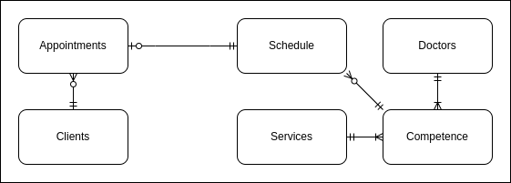
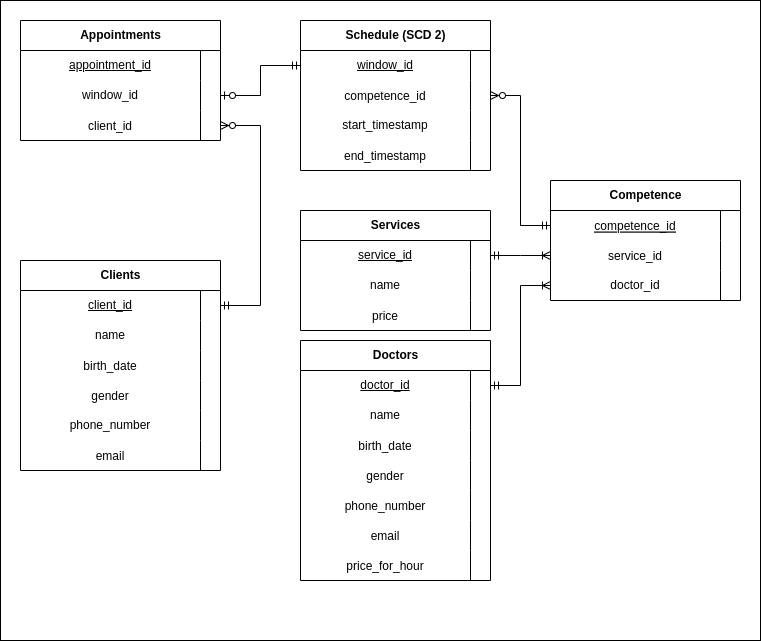
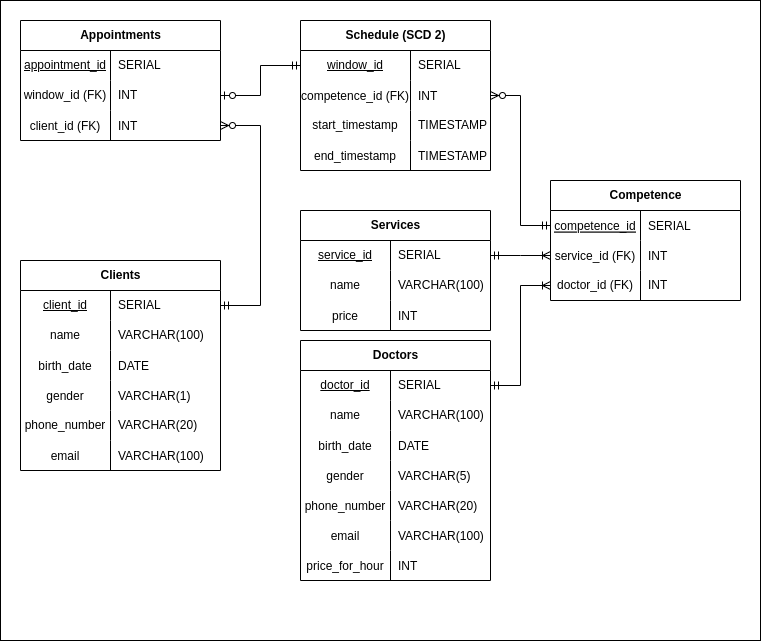

# База данных для клиники

> Автор
>> Лукашев Кирилл, Б05-211

База данных предназначена для учёта записей на приём в поликлинике и включает следующий функционал:
1) Добавление информации о пациентах в базу клиентов.
2) Добавление информации о врачах в базу врачей.
3) Добавление информации об услугах в базу услуг.
4) Добавление компетенций для врачей.
5) Изменение актуального расписания.
6) Запись пациентов на приём.

Для версионирования выбран тип SCD2, так как он наилучшим образом подходит для хранения расписания. Период времени, когда окно записи на приём действительно, совпадает с периодом времени, когда запись в таблице является действительной.

Основная часть базы данных - таблица записей на приём. Она содержит информацию о пациенте и ячейке расписания, которую он посещает. У одной записи может быть только один пациент, но у пациента может быть ноль или более записей. Также у одной записи есть ровно одна ячейка расписания, но у ячейки расписания может быть ноль или одна запись.

Таблица расписания хранит информацию о времени записи и компетенции. У каждой ячейки расписания есть ровно одна компетенция, но у компетенции может быть 0 или более ячеек расписания.

Таблица компетенций содержит связи между врачами и услугами. У каждого врача может быть одна или более услуг, а у каждой услуги может быть одна или более врачей.

## Концептуальная модель

## Логическая модель

## Физическая модель

